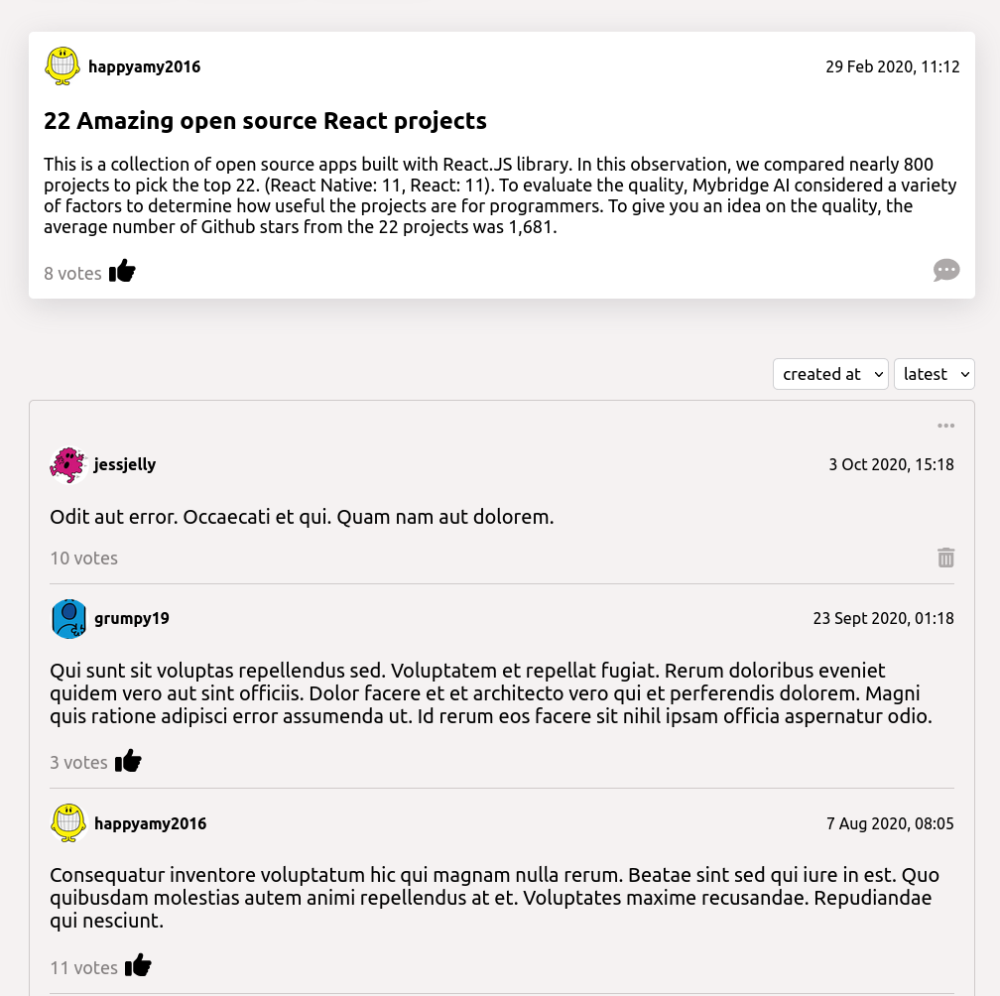

# nC-news

_A mobile-first, responsive Front-End app build with ReactJS and CSS-modules which interacts with my own API. It's a news article app where you can view, like/unlike and leave comments on articles._

**Live URL**: [https://nenad-nc-news.netlify.app](https://nenad-nc-news.netlify.app)




## View Back-End API

---

**Live URL**: [https://nenad-nc-news-api.herokuapp.com/api](https://nenad-nc-news-api.herokuapp.com/api)

**GitHub**: [https://github.com/Nesh00/news-api](https://github.com/Nesh00/news-api)

## Login as User to interact with the app

---

To login as a user here's a list of usernames that you can use:

```
tickle122, grumpy19, jessjelly, cooljmessy, weegembump, happyamy2016..
```

## Download

---

You can find the repository on my [**GitHub**](https://github.com/Nesh00/news-frontend) account and clone it down or just download the ZIP file.

```
git clone https://github.com/Nesh00/news-frontend

```

## Basic requirements

---

If you want to run this app on your local machine, make sure you have version [**NodeJS v16.11.0**](https://nodejs.org/en/) installed.

## Installation

---

Once you have the repository on your computer, install the npm packages.

```
npm install
```

## Run app locally

---

```
npm start
```

## Future development

---

My future goal for this app is:

- Add a create new user form
- Add pagination on both articles and comments
- Edit your own comments
- As user you can create, edit and delete your own articles
